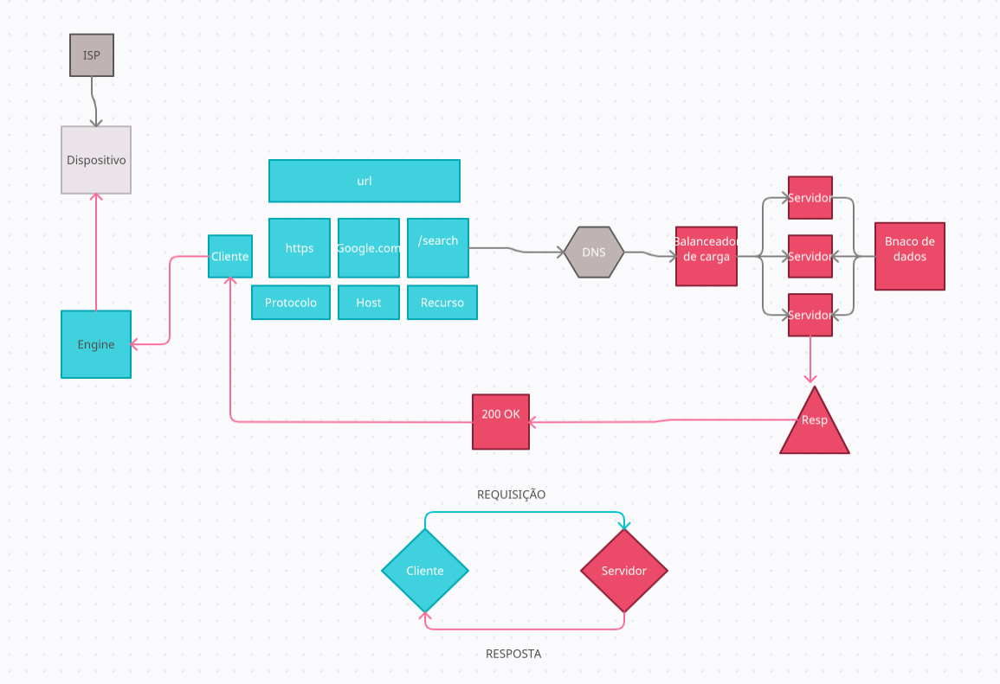

# Exercício

## Dinâmica com Post-its

Utilizar uma ferramenta online para desenhar em conjunto um diagrama de como a internet funciona! Vá para o Slack para instruções sobre qual ferramenta utilizar!🗯__
Vocês devem utilizar a ferramenta para descrever as partes (protocolos, recursos, mecanismos, etc) envolvidas quando enviamos uma requisição a partir de um cliente para um servidor.

